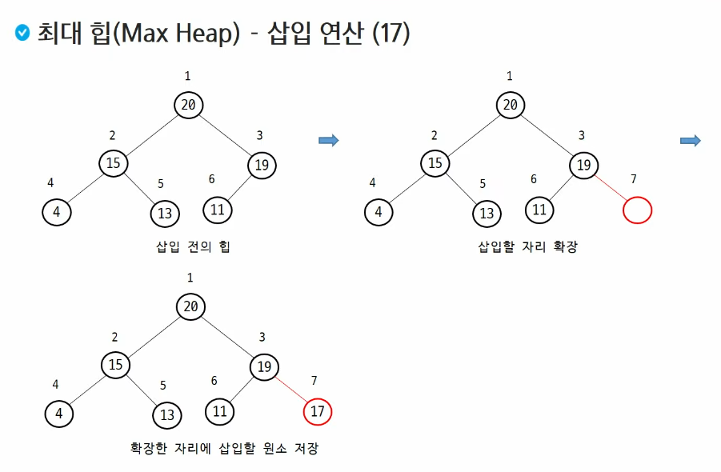
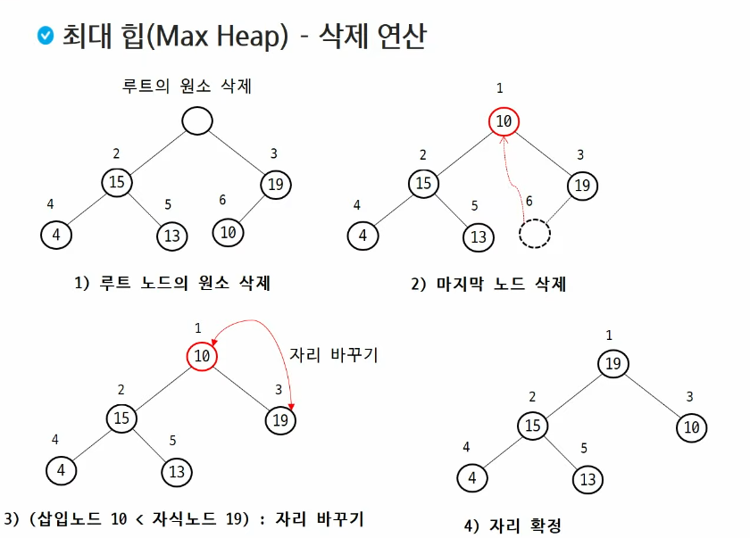
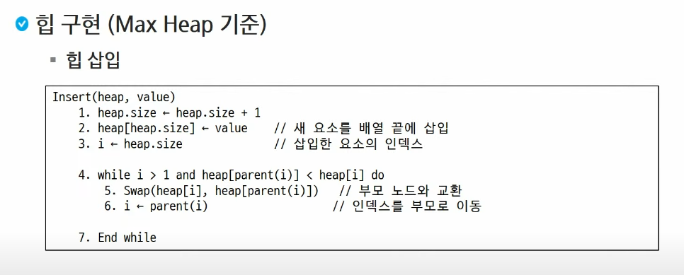
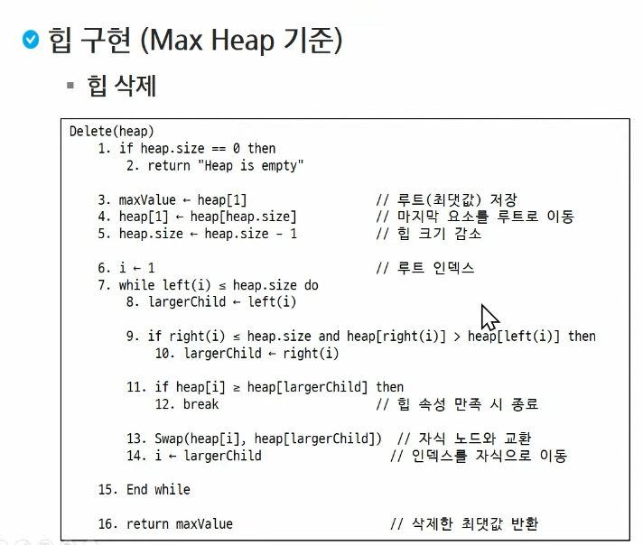

# 힙(Heap)

>- 완전 이진 트리를 기반으로 하는 특수한 트리 기반의 자료구조
>- 부모 - 자식 간의 특정한 순서(규칙)을 따르는 자료구조
>- 최댓값 또는 최솟값을 빠르게 찾을 수 있는 특성을 가짐
>- 우선순위 큐를 구현하는데 주로 사용
>- 삽입, 삭제, 탐색 연산을 효율적으로 수행

### 최대 힙(Max Heap)

- 키 값이 가장 큰 노드를 찾기 위한 완전 이진 트리
- 부모 노드의 기 킶 >= 자식 노드의 키 값
- 루트 노드 : 키 값이 가장 큰 노드

### 최소 힙(Min Heap)

- 키 값이 가장 작은 노드를 찾기 위한 완전 이진 트리
- 부모 노드의 키 값 <= 자식 노드의 키 값
- 루트 노드 : 키 값이 가장 작은 노드

힙은 최소 힙 아니면 최대 힙만 존재한다. 우선순위 큐는 우선순위가 있어야 하기 때문에 최소이거나 최대값을 기준으로 해야한다. 

### 힙의 삽입 연산

1. 새 요소를 트리(배열)의 끝에 삽입
2. 부모 노드와 비교
3. 힙 속성이 위반된 경우, 부모와 교환
4. 힙 속성이 만족될 때까지 2,3번 반복 수행

`- 시간복잡도: O(log N)`

### 힙의 삭제 연산

1. 루트 노드(최대값/최소값)를 제거
2. 마지막 노드를 루트로 이동
3. 자식 노드와 비교
4. 힙 속성 위반시 자식과 교환
5. 힙 속성이 만족될 때까지 3, 4번 반복 수행

> 1차원 배열로 할당했을때, size의 값, 제일 뒤에 있는 값을 제거한, 최상위 노드 루트의 자리(인덱스 1)로 옮겨준다.
>
>그리고 정렬.
> 최대힙이면 자식 노드중에 최대값이 되는 것과 비교.
>
> 최소힙이면 자식 노드중에 최소값이 되는 것과 비교.

`- 시간복잡도: O(log N)`

*삭제는 항상 최상위 (루트)만 제거할수 있고 추가는 항상 마지막 자식 노드에만 가능하다.*

### 힙 구현 의사코드(pseudo code)

### 힙 삭제  의사코드(pseudo code)

### 힙 정렬(Heap Sort)

- 힙 자료구조를 활용한 비교 기반 정렬 알고리즘

1. 정렬하고 싶은 모든 요소를 힙에 삽입(반복)
2. 힙에서 순차적으로 값을 삭제하여 출력
- 중간에 값을 다시 넣었다가 빼면 정렬이 틀어질 수 있음

`- 시간복잡도: O(log N)`