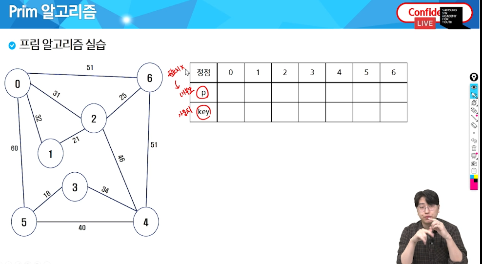

# 프림과 다익스트라

## 프림

인접그래프를 설정할때, 내 부모는 처음 비워둬도 되고 자기 자신으로 설정해도 된다.
Key값은 임의의 아주 큰 수로 설정을 해둔다.

시작 위치부터 방문하면서 시작위치의 가중치를 0으로 설정을 한다.
그리고 key값이 제일 작은 것들 중에서, 선택된 것과 연결된 간선을 갱신한다.

갱신할 수 있는 만큼 갱신을 해준다. 

그 다음 방문되지 않은 것들 중에서 가중치가 제일 작은 애들 중에서 다음 차례를 선택한다.

또 갱신을 하기 위해 이미 저장된 가중치와 비교한다. 만약 새로 선택된 정점의 가중치가 기존 기록된 것보다 작으면, 
가중치를 갱신해주고 부모의 값도 새로 설정해준다.

## 다익스트라