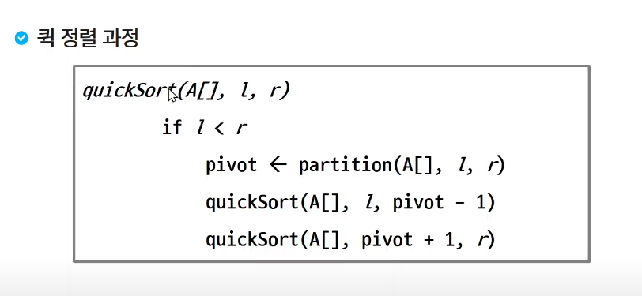

## 분할정복

- 이진 검색
- 병합 정렬
- 퀵 정렬

문제: 가짜 동전 찾기
> N개의 동전들 중에 가짜 동전이 하나 포함되어 있다. 가짜 동전은 진짜 동전에 비해 아주 조금 가볍다.
> 진짜 동전들의 무게가 동일하다고 할 때 양팔 저울을 이용해서 가짜 동전을 찾아보자.

- 한명씩 검사를 하는 것이 확실하겠지만 효율적인 방법은 아니다. 
- 절반씩 A, B그룹으로 나누어서 지어 검사를 한다. 한쪽만 검사를 해서 그 쪽에 범인이 없다면 반대쪽 그룹에 범인이 존재할것이다.
- 다시 또 절반을 나누어서 한쪽만 검사를 한다. 검사한 그룹에서 범인이 나오면, 범인이 나온 그룹을 절반으로 나누어서 범인이 나올때까지 검사를 한다.
- 이진 탐색.

위와 같은 문제들에 분할정복을 사용할 수 있다.

### 분할 정복

- 큰 문제를 작은 하위 문제로 나누어 해결하는 방식
- 과거의 군사적인 유래부터 현대의 컴퓨터과학에서 응용까지 활용되는 개념

### 설계 전략

- 분할(divide) : 해결할 문제를 여러 개의 작은 부분으로 나눈다.
- 정복(Conquer) : 나눈 작은 문제를 각각 해결한다.
- 결헙(Combine) : (필요하다면) 해결된 해답을 모은다.

C^8승을 하기 위해서 C를 8번 곱하지말고, C의 4승을 알고 있다면 C의 4승을 2번 곱하면 된다.

- 처음 중앙값을 구할때, 두 수의 합이 int 범위를 벗어나지 않는지 확인하는거 매우 중요!

- BST(binart Search tree)는 중위순회를 하면 정렬된 값을 출력할 수 있고,
- 제일 왼쪽 자식노드부터 제일 오른쪽 자식 노드까지 오름차순으로 되어 있다.

분할하고 병합하면서 정렬을 한다.

### 퀵 정렬

- 보통 첫번째 요소 고르기, 중앙 요소 고르기가 쉬워서 학습할때 많이 배운다.

