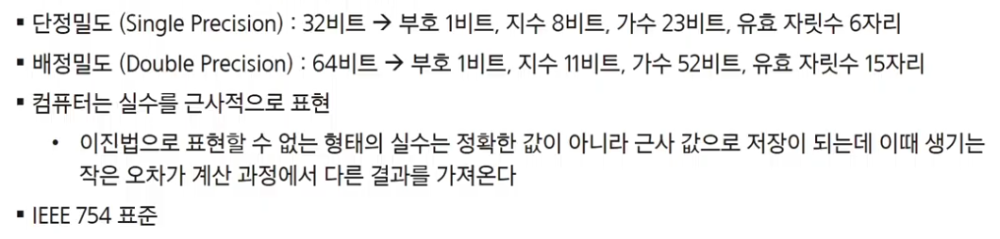

# 비트연산자 & 부분집합

## 컴퓨터 수 표현

- 2진접(Binary)
- 0과 1 두 숫자를 사용
- 컴퓨터 내부에서 데이터를 처리하는데 주로 사용


- 8진법(Octal)
- 0 ~ 7까지의 8개 숫자를 사용
- 과거 컴퓨터 시스템에서 메모리 주소를 간략하게 표현하기 위해 사용


- 16진법(Hexadecimal)
- 0 ~ 9, A~F까지의 문자 사용
- 컴퓨터 과학에서 메모리 주소나 색상 코드 등을 표현할 때 사용.

10진수 -> 2진수로 변환
- 나머지 연산을 반복하여 2진수를 얻을 수 있음.


149 == 10010101

10진수의 몫이 0이 될때까지 2로 나누고,  각각의 나머지를 아래에서부터 위로 나온 값들을 연결하면 2진수의 값이 나온다.

8진수 -> 10진수로 변환


- 음의 정수 표현 방법(부호 비트)
- 최상위 비트(MSB, Most Significant Bit)를 부호 비트로 사용하고 나머지 비트는 수샂의 크기를 표현
  - 양수 -> 0, 음수 -> 1

### 음의 정수 표현 방법(1의 보수)

보수: 수학과 컴퓨터 과학에서 숫자나 비트의 값을 반전시켜, 주어진 숫자를 다른 형태로 표현하는 방법
양수와 음수의 표현이 서로 반대(비트 반전을 통해 표현 가능)

### 음의 정수 표현 방법(2의 보수)
- 1의 보수에서 1을 더한 값
- 컴퓨터 시스템에서 음수를 표현하는 가장 일반적인 방법
- 단 하나의 0만 존재
- 덧셈과 뺄셈을 동일한 방식으로 처리 가능

번외 공부 주제) 왜 1의 보수에 1을 더하면 2의 보수가 될까?
- 따로 공부해봐라.

### 실수의 표현( 고정 소수점, Fixed-Point)
- 소수점 위치가 고정된 상태로 숫자를 표현
- 정수부와 소수부의 비트 수가 고정
- 구현이 간단하고 계산이 빠르지만, 나타낼 수 있는 숫자 범위가 제한적임

### 실수의 표현( 부동 소수점, Floation-Point)
- 가수(mantissa)와 지수(exponent)로 분리하여 숫자를 표현
- 소수점의 위치를 이동시켜 표현. 소수점의 위치를 왼쪽의 가장 유효한 숫자 다음으로 고정시키고 밑 수의 지수 승으로 표현





### 비트 연산자

- 주어진 숫자를 2진수로 표현한 후, 각 비트를 개별적으로 연산하는 방식
- 컴퓨터 내부에서 기본적으로 사용


- 비트 연산자 종류
- AND 연산자(&)
- OR 연산자(|)
- XOR 연산자 (^) -> exclusive or
- NOT 연산자 (~)
- Shift 연산자(<<,>>,>>>)


```
if (a == 1)
    a = 0;
else 
    a = 1;
    
이 코드를 

a^=1;

이처럼 줄여버릴 수 있다.
```

```
5 << 1 -> 10

<< 할때마다 *2가 된다.

6 >> 1 -> 2

>> 할때 /2 하게 된다. 소수점은 버려진다.
```


### 부분집합(Powerset)

- 주어진 집합의 원소 중 일부 또는 전체를 포함하는 집합
- 공집합 또한 부분집합의 일부
- 집합의 원소가 N개인때, 부분집합의 수는 2^N개 (각각의 원소를 포함 or 미포함 2가지의 경우)

```java

```
