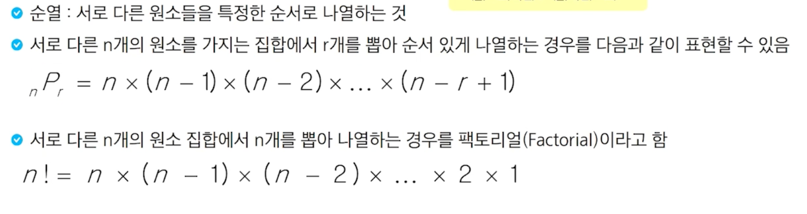

# 순열

- 서로 다른 원소들을 특정한 순서로 나열하는 것
- 서로 다른 n개의 원소를 가지는 집합에서 r개를 뽑아 순서 있게 나열하는 경우를 다음과 같이 표현할 수 있다.

- 0~9까지의 숫자를 활용하여 4자리 비밀번호를 만드는 경우 만들 수 있는 경우의 수를 구하시오,
- 5명의 사람을 줄을 세우려고 합니다. 경우의 수를 구하시오
등등의 문제가 나온다.

